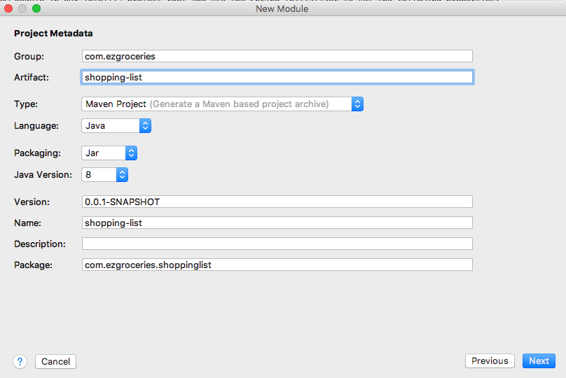

# Lab 01 - Spring Boot

In the root folder, create a Spring Boot application module that will later serve our ezGroceries API. We will start out minimalistic and gradually add dependencies and capabilities.

In this short lab we want to focus on making sure the applications starts successfully and serves the Spring Boot Actuator endpoints. 

## Creation

Create a new module in our IntelliJ project root and use the Spring Initializer to set the following properties:



At this point we will only select the **actuator** and **web** dependency.

After creation make sure this module is properly recognized as Maven module and run the ShoppingListApplication, verify the actuator endpoints are working:

[http://localhost:8080/actuator](http://localhost:8080/actuator)

## Testing

A simple test class called ShoppingListApplicationTests that loads the application context is automatically generated, verify it works.

## Commit and tag your work

Make sure to add, commit and push all your files at least once at the end of every lab. After the lab has been completed completely please tag it with the appropriate lab number:

````
git tag -a lab01 -m "lab01"
````