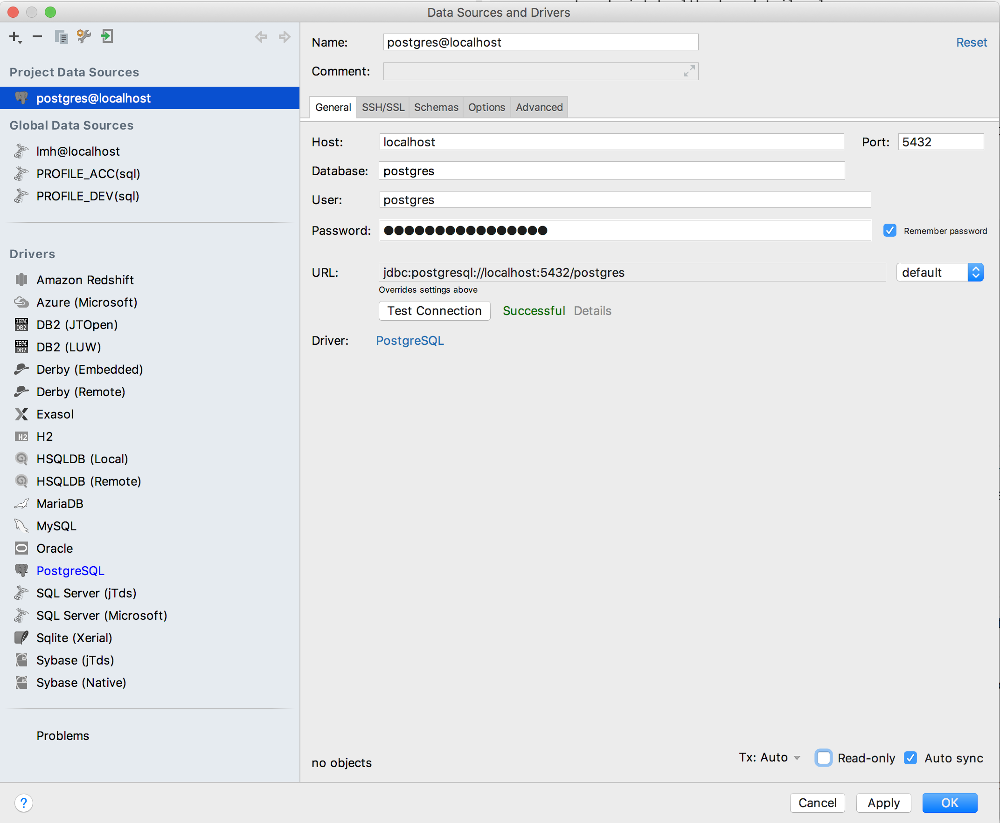
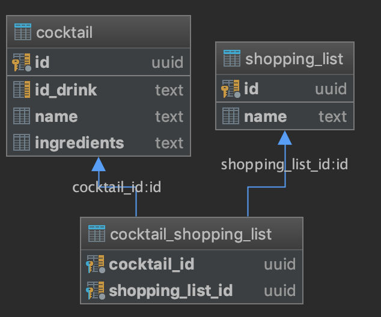

# Lab 05 - Persistence Capability

For implementing our Shopping List functionality we will need some kind of persistence. In this lab we're first going to add the technical capability of talking to a database from our Spring Boot app.

We'll choose Postgres as a common database solution.

## Run Postgres locally

When developing locally we'll run postgres through a docker container, this can be easily done by running this command. The first time we run this the postgres docker image will be downloaded:

```
docker run -e POSTGRES_PASSWORD=mysecretpassword -p 5432:5432 -d postgres
```

Example successful output:
```
Unable to find image 'postgres:latest' locally
latest: Pulling from library/postgres
6ae821421a7d: Pull complete
...
67d715e4939e: Pull complete
Digest: sha256:f310592cf3964f038dbaefac2dc2088982e5ab06312a590bcacc97749ee5db69
Status: Downloaded newer image for postgres:latest
6d646f5860aa796e2decbce4ffb51b91faf196fb1b2df92db21e27c947d3b33e
```

For more information about the usage of this Docker image see:

https://hub.docker.com/_/postgres

## Connect our Spring Boot application

Add a postgres Maven dependency for the JDBC driver:
```
<dependency>
    <groupId>org.postgresql</groupId>
    <artifactId>postgresql</artifactId>
    <version>42.2.5</version>
</dependency>
```

We'll use Spring Data JPA, add the appropriate Spring Boot starter:

```
<dependency>
    <groupId>org.springframework.boot</groupId>
    <artifactId>spring-boot-starter-data-jpa</artifactId>
</dependency>
```

In our application.properties we can add all the JDBC connection data:

```
## Spring datasource
spring.datasource.url=jdbc:postgresql://localhost:5432/postgres
spring.datasource.username=postgres
spring.datasource.password=mysecretpassword

# The SQL dialect makes Hibernate generate better SQL for the chosen database
spring.jpa.properties.hibernate.dialect=org.hibernate.dialect.PostgreSQLDialect
spring.jpa.properties.hibernate.jdbc.lob.non_contextual_creation=true

# Hibernate ddl auto (create, create-drop, validate, update)
spring.jpa.hibernate.ddl-auto=validate
```

Restart your ShoppingListApplication, if it starts up successfully check the logs for some indication that database connections are working.

To further verify correct connection we're going to enable extra information on our actuator healthpoint, add this in your application.properties file:
```
# Actuator
management.endpoint.health.show-details=always
```

Restart your application and go the the health endpoint:

http://localhost:8080/actuator/health

You'll see that now our health endpoint also includes database connectivity out of the box, neat!

Example:
```
{
"db": {
    "status": "UP",
    "details": {
        "database": "PostgreSQL",
        "hello": 1
}
```

## SQL Client (Optional)

To interact with our database it's convenient to use a SQL client for troubleshooting and interacting with our data. For example in Intellij we can easily set-up a datasource to connect to our local Postgres instance:



Make sure to first download the appropriate drivers, set-up in other SQL clients will be very similar.

## Flyway

Version controlling a database schema is always a challenge. In our application we want to tightly control and evolve our database schema alongside our code.

To accomplish this we're going to use flyway, give yourself a small introduction by checking out their website:

https://flywaydb.org/documentation/

Let's start by adding Flyway to our project, we need to add this dependency:
```
<dependency>
    <groupId>org.flywaydb</groupId>
    <artifactId>flyway-core</artifactId>
</dependency>
``` 

Spring provides integration with Flyway out of the box, for configuration see:

https://docs.spring.io/spring-boot/docs/current/reference/html/howto-database-initialization.html#howto-execute-flyway-database-migrations-on-startup

## Shopping List Schema

Let's define our Shopping List schema using flyway migration scripts, the first script is provided:

Location: ````src/main/resources/db/migration/V0.1__Add_Shopping_List_Table.sql````

Content:
```
create table SHOPPING_LIST (
  ID UUID PRIMARY KEY,
  NAME TEXT
);
```

IMPORTANT: Pay attention to use only upper cased names for tables and columns, to avoid incompatibility issues when using HSQLDB later. 

Start our ShoppingListApplication, take a look at the logging, you'll see Flyway executing the script:

```
o.f.c.i.s.JdbcTableSchemaHistory         : Creating Schema History table: "public"."flyway_schema_history"
o.f.core.internal.command.DbMigrate      : Current version of schema "public": << Empty Schema >>
o.f.core.internal.command.DbMigrate      : Migrating schema "public" to version 0.1 - Add Shopping List Table
```

After successful start-up, use your SQL Client to have a look at the flyway_schema_history table. Make sure you understand it's role, have a look at the Flyway documentation if necessary.

To implement our Shopping List functionality in the next lab, we'll first need the entire schema. This just involves a many-to-many relationship between cocktails and shopping lists. 

Add appropriate Flyway migration scripts to end up with this schema, find out how to best define the foreign key relationships in postgres:



## Embedded database

To keep development options open we also want to enable quick local development by adding the option to start our application using an embedded in-memory database.

In this case we'll use HSQLDB, add this dependency:

```
<dependency>
    <groupId>org.hsqldb</groupId>
    <artifactId>hsqldb</artifactId>
</dependency>
```

To be able to easily switch we'll use Spring's Profile support. Alongside the application.properties provide a new file called application-hsqldb.properties, contents:

```
spring.datasource.url=jdbc:hsqldb:mem:testdb;sql.syntax_pgs=true
spring.jpa.properties.hibernate.dialect=org.hibernate.dialect.H2Dialect
```

This is a convenient Spring naming convention, if we start our application and set "hsqldb" as the active profile these properties will override the ones from the standard application.properties.

You can test running the application with this profile, in IntelliJ you can add an extra run configuration by duplicating the ShoppingListApplication one and setting "hsqldb" in the active profiles textbox.

## Commit and tag your work

Make sure to add, commit and push all your files at least once at the end of every lab. After the lab has been completed completely please tag it with the appropriate lab number:

````
git tag -a lab05 -m "lab05"
```` 